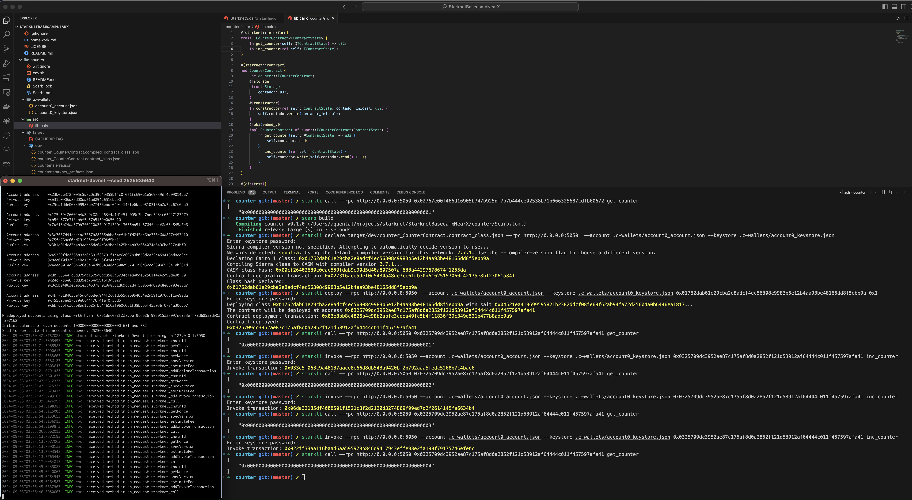

# [Cairo] Counter _smart contract_

## env setup - infra
> [!TIP]
> Version is important

### _starkli_ ⚠️

```sh
starkliup --version 0.3.4
```

### _starknet-devnet_

```sh
cargo install starknet-devnet
```

### _scarb_

```sh
asdf plugin add scarb
asdf install scarb 2.6.5
asdf global scarb 2.6.5
```

## **setup** - execution

```sh
starknet-devnet --seed 2525635640
```
| Item | Value |
| --- | --- |
| Account address | 0x72ffeb1cfb9b00f4df13b26f393ad923b3a3bdfe1ca293dc871fbb3114355a9 |
| Private key | 0xba489462e093e740187771f23ea83db |
| Public key | 0x5afff160be71e265edbca9da1acbad7996f2661174eb3c2a4f4f0711d2cf12c |

### Signer

```sh
starkli signer keystore from-key .c-wallets/account0_keystore.json
```


>Enter private key:
>
>Enter password:
>
>Created new encrypted keystore file: _/Users/aquental/projects/starknet/StarknetBasecampNearX/counter/.c-wallets/account0_keystore.json_
>
>Public key: **0x05afff160be71e265edbca9da1acbad7996f2661174eb3c2a4f4f0711d2cf12c**


### Fetch account

```sh
starkli account fetch 0x72ffeb1cfb9b00f4df13b26f393ad923b3a3bdfe1ca293dc871fbb3114355a9 --rpc http://0.0.0.0:5050 --output .c-wallets/account0_account.json
```

>c-wallets/account0_account.json
>
>Account contract type identified as: _OpenZeppelin_
>
>Description: OpenZeppelin account contract v0.8.1 compiled with cairo v2.4.1
>
>Downloaded new account config file: _/Users/aquental/projects/starknet/StarknetBasecampNearX/counter/.c-wallets/account0_account.json_


### Declare contract

```sh
starkli declare target/dev/counter_CounterContract.contract_class.json --rpc http://0.0.0.0:5050  --account .c-wallets/account0_account.json --keystore .c-wallets/account0_keystore.json
```

>Enter keystore password:
>
>Sierra compiler version not specified. Attempting to automatically decide version to use...
>
>Network detected: sepolia. Using the default compiler version for this network: 2.7.1. Use the --compiler-version flag to choose a different version.
>
>Declaring Cairo 1 class: **0x01762dab61e29cba2e8adcf4ec56308c9983b5e12b4aa93be48165dd8f5ebb9a**
>
>Compiling Sierra class to CASM with compiler version 2.7.1...
>
>CASM class hash: **0x00cf26402680c0eac559fdab9e90d5d40a807507af633a44297678674f1255da**
>
>Contract declaration transaction: 0x027316aee5def0d5434a48de7cc61cb30d61625157060c42175e8bf23061a84f
>
>Class hash declared:
>
>**0x01762dab61e29cba2e8adcf4ec56308c9983b5e12b4aa93be48165dd8f5ebb9a**


### Deploy

```text
starkli deploy --rpc http://0.0.0.0:5050  --account .c-wallets/account0_account.json --keystore .c-wallets/account0_keystore.json 0x01762dab61e29cba2e8adcf4ec56308c9983b5e12b4aa93be48165dd8f5ebb9a 0x1
```

>Enter keystore password:
>
>Deploying class 0x01762dab61e29cba2e8adcf4ec56308c9983b5e12b4aa93be48165dd8f5ebb9a with salt 0x04521ea419699595821b2382ddcf08fe69f62ab94fa72d256b4a0b6446ea1817...
>
>The contract will be deployed at address _0x0325709dc3952ae87c175af8d0a2852f121d53912af64444c011f457597afa41_
>
>Contract deployment transaction: _0x03e8bb8c4826b4c98b2abfc3ceea49fc5b4f11836f39c349d521b477b8ade9a9_
>
>Contract deployed:
>
>**0x0325709dc3952ae87c175af8d0a2852f121d53912af64444c011f457597afa41**


## Interacting

```sh
starkli call --rpc http://0.0.0.0:5050 0x0325709dc3952ae87c175af8d0a2852f121d53912af64444c011f457597afa41 get_counter

[
    "0x0000000000000000000000000000000000000000000000000000000000000012"
]
```

```sh
starkli invoke --rpc http://0.0.0.0:5050 --account .c-wallets/account0_account.json --keystore .c-wallets/account0_keystore.json 0x0325709dc3952ae87c175af8d0a2852f121d53912af64444c011f457597afa41 inc_counter

[]
```

---


